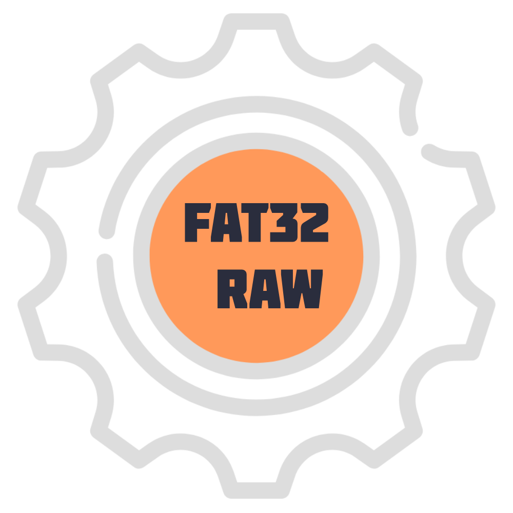

<div align="center">
    
	<h1> FAT32-Raw 🚀</h1>
	<a href="https://github.com/meowrch/fat32-raw/issues">
		
	</a>
	<a href="https://github.com/meowrch/fat32-raw/stargazers">
		
	</a>
	<a href="./LICENSE">
		
	</a>
    <br>
	<br>
	<a href="./README.ru.md">
		
	</a>
	<a href="./README.md">
		
	</a>
</div>

Полнофункциональная Rust-библиотека для прямой работы с FAT32-разделами и образами. Обеспечивает низкоуровневый доступ к файловой системе FAT32 с поддержкой чтения, записи, создания и удаления файлов и директорий.

## ✨ Ключевые особенности

### 🎯 Основные возможности
- **Прямая работа с разделами**: Нативная поддержка ESP (EFI System Partition), SD-карт, USB-флешек
- **Кроссплатформенность**: Полная поддержка Windows и Linux с обработкой специфичных для ОС особенностей
- **Полный функционал FAT32**: Чтение, запись, создание, удаление файлов и директорий
- **Вложенные директории**: Поддержка создания и навигации по глубоко вложенным структурам каталогов
- **Длинные имена файлов (LFN)**: Полная поддержка Unicode-имён до 255 символов
- **Автоопределение параметров**: Автоматический разбор BPB (BIOS Parameter Block)

### 🔧 Технические преимущества
- **Безопасность**: Минимальное использование `unsafe` кода, строгая типизация
- **Производительность**: Оптимизированные операции чтения/записи с буферизацией
- **Надёжность**: Корректная обработка ошибок, защита от повреждения данных
- **Windows-специфика**: Решение проблем с правами доступа (OS Error 5) через специальные флаги открытия файлов

## 🚀 Быстрый старт

### Работа с образом диска
```rust
use fat32_raw::Fat32Volume;

fn main() -> std::io::Result<()> {
    // Открываем FAT32-образ
    let mut volume = Fat32Volume::open_esp(Some("esp.img"))?
        .expect("Не удалось открыть FAT32-образ");

    // Создаём директории
    volume.create_dir_lfn("config")?;
    
    // Создаём и записываем файл
    volume.create_file_lfn("test.txt")?;
    let content = b"Hello from fat32-raw!";
    volume.write_file("test.txt", content)?;
    
    // Читаем файл обратно
    if let Some(data) = volume.read_file("test.txt")? {
        println!("Содержимое: {}", String::from_utf8_lossy(&data));
    }
    
    // Удаляем файл
    volume.delete_file_lfn("test.txt")?;
    
    Ok(())
}
```

### Работа с реальным ESP-разделом
```rust
use fat32_raw::Fat32Volume;

fn main() -> std::io::Result<()> {
    // Автоматический поиск и открытие ESP-раздела
    // На Windows требуются права администратора
    // На Linux может потребоваться sudo
    let mut volume = Fat32Volume::open_esp(None::<&str>)?
        .expect("ESP-раздел не найден");
    
    // Работаем с разделом так же, как с образом
    volume.create_dir_lfn("MyApp")?;
    volume.create_file_lfn("MyApp_config.txt")?;
    volume.write_file("MyApp_config.txt", b"Configuration")?;
    
    // Перечисляем файлы в корне
    let entries = volume.list_root()?;
    for entry in entries {
        println!("{} - {}", 
            entry.name, 
            if entry.is_directory { "DIR" } else { "FILE" }
        );
    }
    
    Ok(())
}
```

## 📦 Установка

Добавьте в `Cargo.toml`:
```toml
[dependencies]
fat32-raw = "1.0"
```

## 🧪 Тестирование

Проект включает набор тестов для проверки всех операций:

```bash
# Запуск обычных тестов
cargo test

# Запуск тестов на реальном ESP (требует sudo/Administrator)
# ОСТОРОЖНО: этот тест работает с реальным ESP разделом!
sudo cargo test --test real_esp_test
```

## 🏗️ Структура проекта

```
fat32-raw/
├── src/
│   ├── lib.rs              # Главный модуль библиотеки
│   ├── error.rs            # Обработка ошибок
│   ├── fat32/
│   │   ├── mod.rs          # Модуль FAT32
│   │   ├── volume.rs       # Основная логика работы с томом
│   │   ├── directory.rs    # Работа с директориями
│   │   ├── file.rs         # Работа с файлами
│   │   ├── fat_table.rs    # Работа с FAT-таблицей
│   │   ├── lfn.rs          # Поддержка длинных имён файлов
│   │   └── utils.rs        # Вспомогательные функции
│   └── platform/
│       ├── mod.rs          # Платформенные абстракции
│       ├── windows/        # Windows-специфичный код
│       └── unix/           # Unix/Linux-специфичный код
└── tests/
    └── real_esp_test.rs    # Комплексные тесты с реальным ESP
```

## 🚧 Планы развития

- [X] Поддержка создания и удаления файлов и директорий  
- [X] Автоматический поиск ESP раздела на дисках
- [X] Работа с вложенными директориями  
- [X] Полная интеграция с Windows и Linux  
- [X] Решение проблем с правами доступа в Windows
- [ ] ⏳ Поддержка MBR-разделов
- [ ] ⏳ Дефрагментация и оптимизация
- [ ] ⏳ Поддержка FAT12/FAT16
- [X] ⏳ Интеграция с GitHub Actions CI/CD

## 🤝 Вклад в проект

Мы приветствуем вклад в развитие проекта! Пожалуйста:
1. Форкните репозиторий
2. Создайте ветку для ваших изменений
3. Убедитесь, что все тесты проходят
4. Отправьте pull request

## 📄 Лицензия

Проект распространяется под лицензией [GPLv3](./LICENSE).

## 🙏 Благодарности

- Сообществу Rust за отличные инструменты и документацию
- Авторам спецификации FAT32 от Microsoft
- Всем контрибьюторам и пользователям проекта

---

<div align="center">
Сделано с ❤️ используя Rust
</div>
